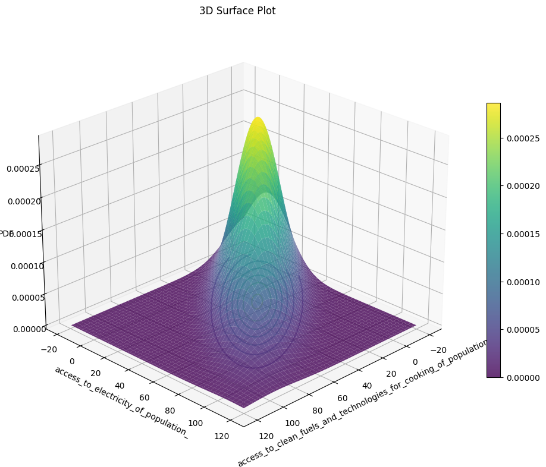
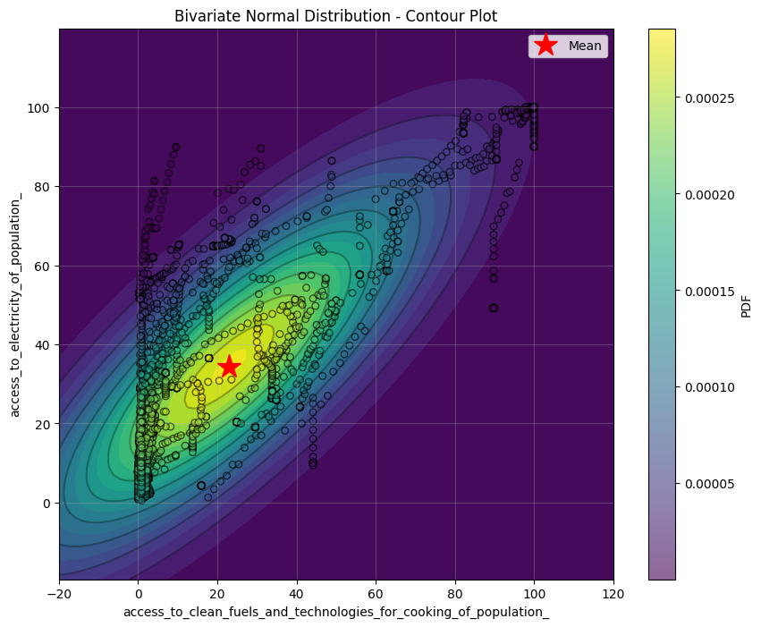

# Formative 3 – Probability Distributions, Bayesian Probability, and Gradient Descent

**Group Members:**
- Angie Noel
- Modestine Nformi
- Sharif Kiviir
- Josephine Kanu


## **This repository contains implementations for four different analytical tasks:**
1) working with a **bivariate normal distribution** and visualising probability densities,
2) applying **Bayes’ Theorem**,
3) implementing **Gradient Descent for Multiple Variables**.
4) Code version of the **Gradient Descent**

Each part is self-contained in its own folder.


## Repository Structure


```
.
├── part1/   # Bivariate normal distribution analysis & plots
├── part2/   # Bayes’ Theorem implementation 
├── part3/   # Gradient Descent implementation
├── part4/   # Gradient Descent implementation (vectorised)
└── README.md
```


## Part 1: Bivariate Normal Distribution

- We defined a bivariate normal PDF with means, variances and correlation.
- We generated a probability density surface and contour plots.
- We demonstrated how different correlation values affect the joint PDF shape.

Plots generated in this section:

| 3D | Contour |
|--------|--------|
|   |  |

---

## Part 2: Bayes’ Probability

Implementation of Bayes’ Theorem and demonstration with example values.

We showed how posterior probability changes based on prior + evidence likelihood and illustrated the difference between P(A|B) and P(B|A).


---

## Part 3: Gradient Descent

-We started by calculating the predicted y values(output).
-We calculated the error by subtracting the predicted y values from the actual y  values
-We derived formulas for calculating the gradients of the slope(m) and y intercept(b) by differentiating the MSE formula with respect to m and b respectively.
-We then calculated the gradients using these formulas and used them to update our 'm' and 'b' .
-We used our new 'm' and 'b'to make more interations

| Iteration 1 | Iteration 2 | Iteration 3 | Iteration 4 |
|--------|--------|--------|--------|
| ||||

The observed trend is that the first iteration produces values of 'm' and 'b' that are way too far from the first random values. This shows how wrong the output is from th actual output. The values from the second iteration shows small change because the output is getting nearer to the actual output meaning our error is getting smaller and smaller each iteration.


- [Gradient Descent Calculations](https://drive.google.com/file/d/11Yd_ZBoveISbyuohxkGXQEJhFIzlOgOO/view?usp=sharing)
## Part 4: Gradient Descent for Multiple Variables

- We implemented multivariate linear regression using **vectorized gradient descent**.
- We ran 4 iterations to illustrate update steps.
- Then we used SciPy to verify correctness.

---

## Requirements

pip install numpy pandas matplotlib scipy scikit-learn


---
